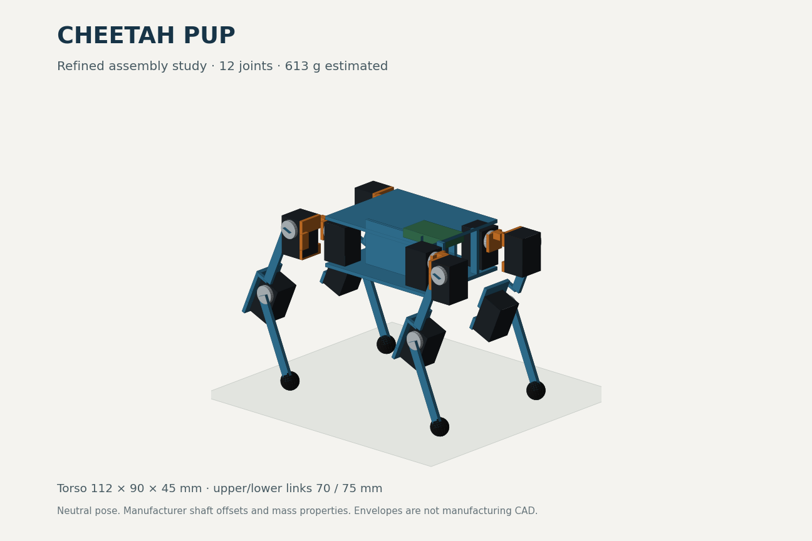

# Cheetah Pup

A compact, original 12-joint quadruped project for learning robotics reinforcement
learning. It uses MIT Cheetah-inspired leg kinematics and practical Microduck software
references, with **no custom servo-characterization work required from the owner**.

This independent branch is `codex/microduck-research-20260904`. The parallel agent's
branch is kept separate; [its original handoff](docs/HANDOFF.md) is historical context.

**Start here:** [implementation plan](docs/implementation/PLAN.md) ·
[decisions](docs/implementation/DECISIONS.md) ·
[current results](reports/primitive-validation.md) ·
[research](docs/microduck-review/RESEARCH.md).

## Current milestone

The original primitive MuJoCo model, analytical kinematics and static load screening
are implemented. The component allowance totals **613 g**, including twelve 18 g
XL330 motors as a provisional candidate. **26 tests pass**: FK/Jacobians, transformed
base poses, mirrored legs, masses/inertias, joint limits, terrain dimensions, and
support-force balance. A 45-variant sensitivity screen varies stance, link lengths
and nonmotor mass without shrinking motor envelopes.



**[Watch the planned crawl animation](reports/gait-demo.md)** — body weight shifts,
one-foot-at-a-time steps and a top view of the support polygon. This is a prescribed
kinematic demonstration, not a trained gait or validated motor performance.

The initial geometry has useful four-foot static margin, but lifting a foot requires
body weight shifts and further load checks. Motor selection remains open. The
screening model uses ideal PD, not BAM; no learned walking policy, manufacturing CAD,
real carpet traversal or hardware performance is claimed. The image is a software
projection of the compiled MuJoCo neutral pose. Self-collision and packaging remain
unvalidated.

## Reproduce the first milestone

Requires Python 3.12 and `uv`. Run from the repository root:

```sh
uv sync --locked
uv run pytest -q
uv run cheetah-pup build
uv run cheetah-pup validate
uv run cheetah-pup render
```

These commands use CPU MuJoCo; no CUDA, cloud account, hardware or submodule
initialization is needed. Rendering uses Matplotlib's software backend. An optional
`render --renderer mujoco` uses MuJoCo's native renderer and needs a working OpenGL
installation; it was unavailable in this cloud environment. The software preview was
generated successfully instead.

Other scenes:

```sh
uv run cheetah-pup build --terrain threshold --output models/cheetah_pup_threshold.xml
uv run cheetah-pup build --terrain carpet --output models/cheetah_pup_carpet_placeholder.xml
```

The carpet scene is explicitly a rigid friction placeholder. The 10 mm threshold
exists in the scene; traversal is not demonstrated. Edit [config/robot.json](config/robot.json)
to change geometry, mass allowances or diagnostic gains, then regenerate and validate.

## Next implementation slice

1. Evaluate body shifts, useful foot workspace and mechanical clearance against the
   desired crawl and threshold motion; keep rejected designs in the report.
2. Integrate a coherent published BAM model with explicit voltage/controller settings
   and CPU/GPU parity. Resolve the calibration-provenance gap before hardware purchase.
3. Build the quadruped RL task and prepare a capped cloud smoke-training job. Detailed
   CAD and PCB work follow the evidence gates in the plan.

Our original code is [MIT licensed](LICENSE). Pinned upstream references retain their
own licenses; see [reference scope](docs/microduck-review/REFERENCES.md). In particular,
Microduck model assets are not treated as Apache-licensed manufacturing CAD.
