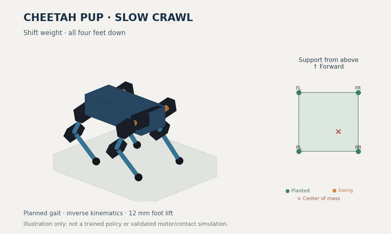

# Planned crawl animation



[MP4 version](crawl-gait.mp4)

This is a prescribed inverse-kinematics demonstration on the current primitive
robot. It is **not a learned policy, a dynamics rollout, or proof that the motors
can execute this gait**. Playback timing is illustrative and deliberately slow.

The cycle moves rear right → front right → rear left → front left. Before each
step the torso shifts toward the support triangle's centroid; the modeled center
of mass, including moving links, is used to refine that shift. The remaining three
feet stay planted while the moving foot advances 20 mm and lifts up to 12 mm. All
four feet remain down during the body-shift phase. The animation uses a 124 mm hip
height for swing clearance; that is a demonstration choice, not a torque-optimized
stance or a replacement for the baseline configuration.

The right-hand panel shows planted feet in green, the swinging foot in orange,
and projected center of mass with a red cross. Its shaded polygon is the current
support region. Joint limits, foot-target reconstruction and positive vertical
support loads during swing are checked while producing the frames. The complete
results are in [gait-demo-validation.json](gait-demo-validation.json).

Generate 96 frames, then encode a 6.4-second looping cycle (requires FFmpeg):

```sh
uv run python -m cheetah_pup.gait_demo --frames /tmp/cheetah-gait-frames
ffmpeg -y -framerate 15 -i /tmp/cheetah-gait-frames/%04d.png -c:v libx264 -crf 21 -pix_fmt yuv420p -movflags +faststart reports/crawl-gait.mp4
ffmpeg -y -i reports/crawl-gait.mp4 -filter_complex '[0:v]fps=12,scale=800:-1:flags=lanczos,split[a][b];[a]palettegen=max_colors=128[p];[b][p]paletteuse=dither=bayer:bayer_scale=3' -loop 0 reports/crawl-gait.gif
```

Stance-foot locations are fixed in world coordinates. The camera follows average
forward progress so the cycle can loop. The first cycle is discarded as warm-up;
the displayed cycle is from the periodic footprint pattern. Static support checks
do not establish acceleration, friction, actuator torque/speed, thermal limits,
mechanical clearance, or carpet/threshold performance.
