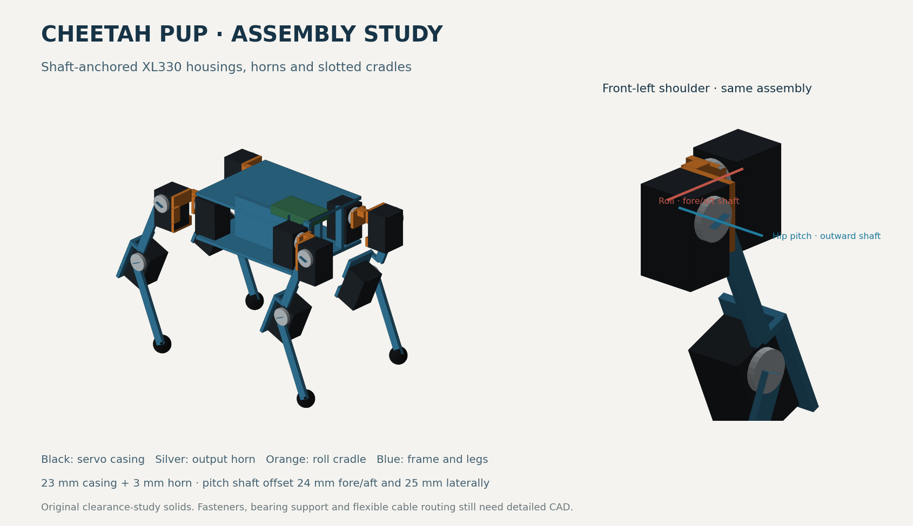

# Assembly and actuator refinement

Updated 2026-09-04 on `codex/microduck-research-20260904`.

The hip visualization needed a physical correction: the old motor boxes were
centered on the joints and shared one orientation. Each servo housing now follows
the actual shaft position and mounting direction. The simulation also runs the
published actuator law instead of relying only on an ideal position controller.

[STEP assembly, 83 named solids](../models/cheetah_pup_assembly.step) ·
[Updated crawl animation](gait-demo.md) ·
[Assembly audit](assembly-validation.md) ·
[Actuator details](../docs/implementation/ACTUATOR.md) ·
[Walking loads](gait-load-validation.md)

## What changed physically

- Manufacturer drawings establish a **20 ×34 ×23 mm casing plus a 3 mm horn**.
  The casing center is 7.5 mm below the shaft along its long direction; the shaft
  is not centered in that rectangle.
- Roll shafts face forward or backward. Hip-pitch and knee shafts face outward
  left or right. Casings belong to their supporting links; output horns rotate
  with the driven links. All twelve shaft lines align with the modeled hinges.
- The pitch shaft sits **24 mm fore/aft outward and 25 mm laterally** from the
  roll shaft. This separates the perpendicular casings and leaves space for socket
  access. Original cradle slots reserve the side-port volumes.
- Knee housing tails point toward the foot, avoiding the shoulder interference
  found with the first installation. Published servo COM and full inertia tensors
  replace uniform-box estimates; other component masses remain allowances.
- The **613 g** budget is unchanged. The **112 ×90 ×45 mm central chassis** is
  only part of the robot's exterior. The exported STEP contains original study
  solids and reproduces the simulated neutral assembly.

Manufacturer PDF/STEP sources were inspected rather than redistributed. Geometry,
source frames, factual dimensions, mass properties and download hashes are recorded
in [the source record](../docs/implementation/SERVO_GEOMETRY_SOURCES.md).

## What passed, and what did not

| Check | Result | Practical meaning |
|---|---|---|
| Shaft placement and motor ownership | All twelve agree with the physical assembly convention | The model no longer treats differently oriented servos as interchangeable centered boxes. |
| Neutral and revised crawl clearance | No solid or reserved-port interference in the neutral pose and 192 sampled crawl poses | These sampled poses fit the modeled envelopes. Flexible cables and fasteners still require detailed CAD. |
| Original deep crawl / broad joint workspace | Collisions found and retained in the report | Scalar joint limits do not by themselves establish a valid workspace. |
| STEP readback | All 83 named solids match the compiled assembly; largest bounds discrepancy below 1e-9 mm | Export transforms and units agree numerically. This does not establish physical tolerances. |
| BAM CPU parity | Bit-exact against pinned upstream over 1,500 loaded-joint steps | The adapter reproduces the upstream implementation; this is not measured servo calibration. |
| 60-second stand, 5 V/P400 | About 4.8 mm height loss, 1.23° maximum tilt, no unwanted contacts | Constant standing targets work in this model. P400 is the published stock gain. The earlier P200 setting fails. |
| Prescribed forward crawl, 12.8 seconds | Wanted +40 mm; achieved approximately −5.2 mm, while remaining upright | Playing the joint animation through the real dynamics is not a working walking controller. |
| Static crawl load | 0.09336 N·m peak; only 1.07× margin to the 0.10 N·m estimate | The proposed 1.5× reserve is not met; hardware motor selection remains open. |
| Retiming the animation to 0.05 m/s | Requires about 1.88× published unloaded joint speed | Simply speeding up the demonstration cannot meet the target. |

**55 tests pass.** Numerical checks cover transformed kinematics, shaft frames,
force/moment balance, independent virtual work, contact-load optimization, SAT
interference checks, and upstream actuator parity/reset/delay behavior. The STEP
is also read back and compared against the compiled solids.

## What simulation accuracy means here

The assembly, actuator implementation and hardware fidelity are separate questions.
We now have a much better physical assembly and a reproducible published motor
model. Its fit provenance and controller assumptions still do not establish exact
behavior of a stock XL330 at 5 V. Gain scaling, PWM slew and current interpretation
are documented uncertainties, not hidden corrections. No owner pendulum rig,
servo testing campaign or parameter fitting has been added.

Likewise, static torque and winding-loss proxies do not prove motor temperature,
battery endurance or carpet performance. The robot still needs whole-robot assembly
checks and progressive validation when hardware exists. Screw engagement, structural
stiffness, support bearings, mated plugs and flexible-wire routing are not released
by this STEP study.

## Decision and next work

Keep XL330 as the current **simulation candidate**, with purchase choice open.
Its low mass and existing model remain useful, but the current crawl has little
static reserve. Compare a smoother controller and lower mass with a stronger
published-model actuator, including the stronger motor's added mass and size.

The next software milestone is a closed-loop quadruped task: standing, then very
slow flat-ground commands near 0.01 m/s before approaching 0.05 m/s. The controller
must react to orientation and joint motion; preset joint targets alone did not
produce the desired progress. Establish the observation/action contract, contact
and reset checks, and CPU/GPU actuator parity before a capped exploratory training
job. Prepare the exact job and cost before any spend.

No hardware was purchased, paid job launched, manufacturing CAD released or PCB
ordered. Manufacturing and deployment wait for the load, model and controller gates
in [the plan](../docs/implementation/PLAN.md).
